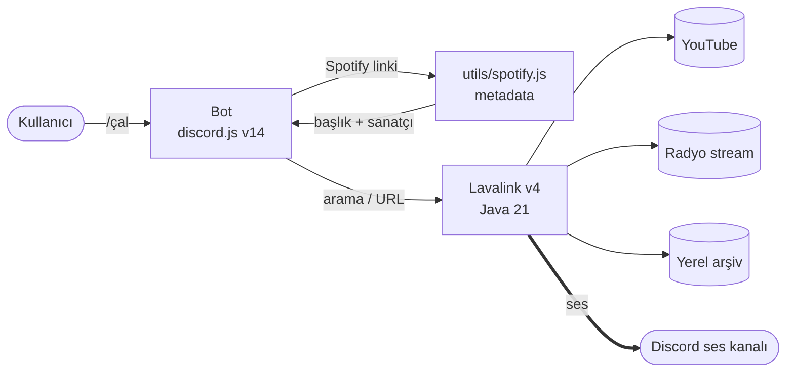

<div align="center">

# 🎵 RAADIO TR

**Türkçe Discord müzik & radyo botu — Lavalink ses altyapısıyla.**


<br />

**≈1 saniyede** çalmaya başlar · YouTube · Spotify · Radyo · Yerel arşiv

</div>

---

## İçindekiler

- [Neden hızlı?](#neden-hızlı)
- [Özellikler](#özellikler)
- [Mimari](#mimari)
- [Gereksinimler](#gereksinimler)
- [Kurulum](#kurulum)
- [Yapılandırma](#yapılandırma)
- [Komutlar](#komutlar)
- [Spotify desteği](#spotify-desteği)
- [Sorun giderme](#sorun-giderme)
- [Lisans](#lisans)

---

## Neden hızlı?

Bot eskiden ses akışını `yt-dlp` ile çözüyordu; her şarkı için 2–4 ayrı Python süreci başlıyordu. Datacenter IP'lerine YouTube'un uyguladığı PO-token kısıtı da üstüne binince `/çal` komutu **10–15 saniye** sürüyordu.

Ses katmanı **Lavalink**'e taşındı: süreç başlatma yok, InnerTube'a JVM içinden doğrudan HTTP, metadata ve stream tek yerden.

| Aşama | Ses başlangıcı |
| --- | --- |
| yt-dlp (sıralı çözüm) | ~10–12 sn |
| Plugin sırası + paralel prefetch | ~4–5 sn |
| **Lavalink** | **~1 sn** |

> Rakamlar üretim VPS'inde (Türkiye, datacenter IP) ölçüldü.

---

## Özellikler

- **🎧 Çoklu kaynak** — YouTube (video, arama, playlist), Spotify (şarkı/albüm/playlist), SoundCloud, doğrudan stream URL'leri
- **📻 Radyo sistemi** — Binlerce istasyon arasında arama, sunucuya özel istasyon listesi, **canlı "şu an çalıyor" bilgisi** (5 sn'de bir güncellenir), yayın koparsa 5 denemeye kadar otomatik yeniden bağlanma
- **🎛️ Buton kontrolleri** — Önceki, durdur, duraklat/devam, geç, ses ±, karıştır, döngü, terket
- **🎤 Sagopa modu** — Sunucudaki yerel arşivden çalar; **sürekli mod** açıkken kuyruk hiç boşalmaz, şarkı bitince yenisi gelir
- **⚡ Tembel çözümleme** — Spotify albümü/playlist'i anında kuyruğa girer, YouTube araması her parça için sırası gelince yapılır
- **🔀 Çoklu bot** — Tek makinede birden fazla bot, tek Lavalink düğümü, ortak ayar dosyaları
- **🛡️ Dayanıklılık** — Gateway sağlık izleme, yakalanmayan hata koruması, çözülemeyen parçada kuyruğu kilitlemeden atlama

---

## Mimari



Spotify **yalnızca metadata kaynağı** — ses her zaman YouTube'dan gelir.

| Dosya | Sorumluluk |
| --- | --- |
| `index.js` | Giriş noktası, komut/event yükleyici, gateway izleme |
| `utils/lavalink.js` | Lavalink kurulumu, `getOrCreatePlayer()`, görüntüleme yardımcıları |
| `utils/lavalinkEvents.js` | Çalıyor embed'i, radyo metadata döngüsü, radyo retry, sürekli Sagopa |
| `utils/spotify.js` | Spotify link çözümleme (şarkı/albüm/playlist) |
| `utils/sagopa.js` | Yerel arşiv tarama ve çözümleme |
| `commands/` | 19 slash komutu |
| `lavalink/application.yml.example` | Lavalink referans yapılandırması |

---

## Gereksinimler

| | Sürüm | Not |
| --- | --- | --- |
| **Node.js** | 22+ | 18+ çalışır, 22 önerilir |
| **Java** | 21 (headless JRE yeterli) | Lavalink için |
| **Lavalink** | v4.2+ | `youtube-plugin` ile |
| **RAM** | ~500 MB boş | Lavalink ~350 MB + bot ~100 MB |
| PM2 | — | Opsiyonel, üretim için önerilir |

Ayrıca bir **Discord bot tokeni** ve _(Spotify istiyorsanız)_ bir **Spotify uygulaması** gerekir.

> **FFmpeg gerekmez.** Ses kodlamayı Lavalink üstlenir; `@discordjs/voice`, opus ve sodium bağımlılıkları da kaldırıldı.

---

## Kurulum

### 1. Java + Lavalink

```bash
# Java 21 (Debian/Ubuntu)
sudo apt update && sudo apt install -y openjdk-21-jre-headless

# Lavalink
mkdir -p ~/lavalink && cd ~/lavalink
curl -sL -o Lavalink.jar \
  https://github.com/lavalink-devs/Lavalink/releases/download/4.2.2/Lavalink.jar
```

Depodaki örneği yapılandırma olarak kopyalayın ve bir parola belirleyin:

```bash
cp /path/to/discord-bot/lavalink/application.yml.example ~/lavalink/application.yml
# application.yml içindeki password alanını düzenleyin
java -Xmx400M -jar Lavalink.jar
```

`Lavalink is ready to accept connections` satırını gördüğünüzde hazırdır.

> **Datacenter/VPS IP kullanıyorsanız** `application.yml` içindeki `clients` sırasını değiştirmeyin — `ANDROID_VR` PO-token istemediği için 403 hatalarını önleyen ana etken odur.

### 2. Bot

```bash
git clone https://github.com/TalhaTufanN/discord-bot.git
cd discord-bot
npm install
```

`.env` dosyasını oluşturun ([aşağıda](#yapılandırma)), sonra:

```bash
npm start          # normal başlatma
npm run dev        # nodemon ile geliştirme
```

Slash komutları bot her açılışta otomatik olarak Discord'a bildirilir.

### 3. Üretim (PM2)

```bash
npm install -g pm2

pm2 start ecosystem.config.js               # her iki botu da başlatır
pm2 start ecosystem.config.js --only raadiotr   # yalnızca ana botu
pm2 save                                    # yeniden başlatmada geri gelsin
pm2 logs                                    # canlı log
```

`ecosystem.config.js` iki bot tanımlar; ikinci bot **opsiyoneldir** (`.env` içinde `TOKEN2` yoksa `--only raadiotr` kullanın).

> `.env` değişkenlerini değiştirdiyseniz `pm2 restart` **yetmez** — kayıtlı ortamı yeniden kullanır. `pm2 delete <ad> && pm2 start ecosystem.config.js` yapın.

---

## Yapılandırma

Kök dizinde `.env` (git'e **girmez**):

```env
# ── Discord ────────────────────────────────
TOKEN=bot_tokeni
CLIENT_ID=bot_client_id
GUILD_ID=sunucu_id            # virgülle birden fazla yazılabilir

# ── İkinci bot (opsiyonel) ─────────────────
TOKEN2=ikinci_bot_tokeni
CLIENT_ID2=ikinci_bot_client_id

# ── Lavalink ───────────────────────────────
LAVALINK_HOST=127.0.0.1
LAVALINK_PORT=2333
LAVALINK_PASSWORD=application_yml_ile_ayni_parola

# ── Spotify (opsiyonel) ────────────────────
# developer.spotify.com/dashboard -> Create app -> Web API
# Boş bırakılırsa Spotify çalışmaz, diğer her şey normal çalışır.
SPOTIFY_CLIENT_ID=
SPOTIFY_CLIENT_SECRET=

# ── Yerel arşiv (opsiyonel) ────────────────
# /sagola komutunun tarayacağı klasör. Lavalink'in okuyabildiği
# bir yol olmalı (aynı makine).
SAGOPA_PATH=/root/discord-bot/music/Sagopa Kajmer
```

---

## Komutlar

### Müzik

| Komut | Parametre | Açıklama |
| --- | --- | --- |
| `/çal` | `<query>` | Şarkı, arama terimi veya URL çalar (YouTube, Spotify, SoundCloud, stream) |
| `/duraklat` | — | Çalan şarkıyı duraklatır |
| `/devam` | — | Duraklatılan şarkıyı devam ettirir |
| `/geç` | — | Mevcut şarkıyı atlar |
| `/durdur` | — | Müziği durdurur ve kuyruğu temizler (kanaldan çıkmaz) |
| `/terket` | — | Ses kanalından ayrılır |
| `/ses` | `<percentage>` | Ses seviyesi (0–100) |
| `/kuyruk` | — | Kuyruğu listeler |
| `/mevcutşarkı` | — | Çalan şarkı + ilerleme çubuğu |
| `/karıştır` | — | Kuyruğu karıştırır |
| `/döngü` | `<mode>` | `Kapalı` · `Şarkı` · `Kuyruk` |

### Radyo

| Komut | Parametre | Açıklama |
| --- | --- | --- |
| `/radyo` | — | Kayıtlı istasyonları menüden çalar |
| `/radyobul` | `<radyo>` | Binlerce istasyon arasında arar _(otomatik tamamlama)_ |
| `/radyoekle` | `[liste]` `[manuel]` | Yeni istasyon ekler _(otomatik tamamlama)_ |
| `/radyoduzenle` | `<isim>` `[yeni_isim]` `[url]` `[aciklama]` `[emoji]` `[kategori]` | İstasyon bilgilerini düzenler |
| `/radyosil` | `<isim>` | İstasyonu siler |

### Diğer

| Komut | Parametre | Açıklama |
| --- | --- | --- |
| `/sagola` | `[arama]` `[surekli]` | Yerel Sagopa arşivinden çalar; `surekli: Aç` ile kuyruk hiç boşalmaz |
| `/kur` | — | Botu tek bir kanalla sınırlar |
| `/yardım` | — | Komut listesi |

---

## Spotify desteği

Spotify **metadata kaynağıdır**; parçalar YouTube'da aranıp oradan çalınır.

| Bağlantı türü | Durum | Nasıl |
| --- | --- | --- |
| Şarkı | ✅ | Resmi Web API |
| Albüm | ✅ | Resmi Web API (tüm parçalar) |
| Playlist | ✅ | Embed sayfası — **ilk 100 parça** |
| Editoryal playlist <br/>(Today's Top Hits vb.) | ✅ | Embed sayfası |
| Sanatçı | ❌ | Desteklenmiyor |

<details>
<summary><b>Neden playlist için farklı bir yol kullanılıyor?</b></summary>

<br />

Spotify, **27 Kasım 2024'ten sonra** oluşturulan uygulamalara bazı uçları kapattı. Ölçümlerimiz duyurudan daha geniş bir kısıtlama gösterdi:

- `/v1/playlists/{id}/tracks` → **403** (kullanıcı listelerinde de, editoryal listelerde de)
- `/v1/playlists/{id}` → 200 ama yanıtta `tracks` alanı **hiç yok**
- Toplu getirme uçları (`/v1/tracks?ids=`, `/v1/albums?ids=`, `/v1/artists?ids=`) → **403**

Son madde, **LavaSrc**'nin bu proje için neden kullanılmadığını da açıklıyor: LavaSrc albüm yüklerken toplu getirme çağrısı yapıyor ve o çağrı 403 alıyor. Bu projede albüm parçaları `/albums/{id}/tracks` ile çekiliyor — toplu getirmeye ihtiyaç duyulmuyor.

Playlist'ler için tek çalışan yol Spotify'ın **embed sayfası**. Resmi bir arayüz değil; Spotify sayfa yapısını değiştirirse çalışmayı bırakabilir. Bu yüzden çözümleme tek bir fonksiyonda izole edilmiş ve başarısız olduğunda kullanıcıya net bir mesaj gösteriliyor — bot çökmez, yalnızca playlist çalışmaz.

</details>

---

## Sorun giderme

| Belirti | Bakılacak yer |
| --- | --- |
| Bot açılıyor ama müzik çalmıyor | `pm2 logs lavalink` — düğüm bağlı mı? `curl -H "Authorization: <parola>" http://127.0.0.1:2333/version` |
| `[Lavalink] Node hatası: ECONNREFUSED` | Lavalink çalışmıyor veya `LAVALINK_PASSWORD` `application.yml` ile uyuşmuyor |
| YouTube'da 403 / parça çalmıyor | `application.yml` → `clients` sırası; `ANDROID_VR` listede olmalı. `youtube-plugin` sürümünü güncelleyin |
| Spotify linki çözülmüyor | `.env` içindeki `SPOTIFY_CLIENT_ID/SECRET` dolu mu? Bot loglarında gerçek hata yazar |
| `.env` değişti ama etkisi yok | `pm2 restart` yetmez → `pm2 delete <ad> && pm2 start ecosystem.config.js` |
| Slash komutları görünmüyor | `.env` içindeki `GUILD_ID` doğru mu? Komutlar yalnızca oraya bildirilir |

---

## Lisans

**© 2026 TalhaTufanN — Tüm hakları saklıdır.**

Bu projenin kaynak kodlarının izinsiz kopyalanması, başka bir isimle paylaşılması, herhangi bir mecrada dağıtılması veya _kendi eseriymiş_ gibi gösterilmesi **kesinlikle yasaktır**.

- ❌ **Yasak:** Projeyi klonlayıp değişiklik yapmadan (veya çok az değişiklikle) sahiplenmek, kodları başka platformlarda izinsiz dağıtmak.
- ✅ **Serbest:** Hata düzeltmesi veya özellik eklemek için _Issue / Pull Request_ açmak — memnuniyetle karşılanır.

Geliştirici: **[@TalhaTufanN](https://github.com/TalhaTufanN)** · Özel kullanım talepleri için doğrudan iletişime geçin.
